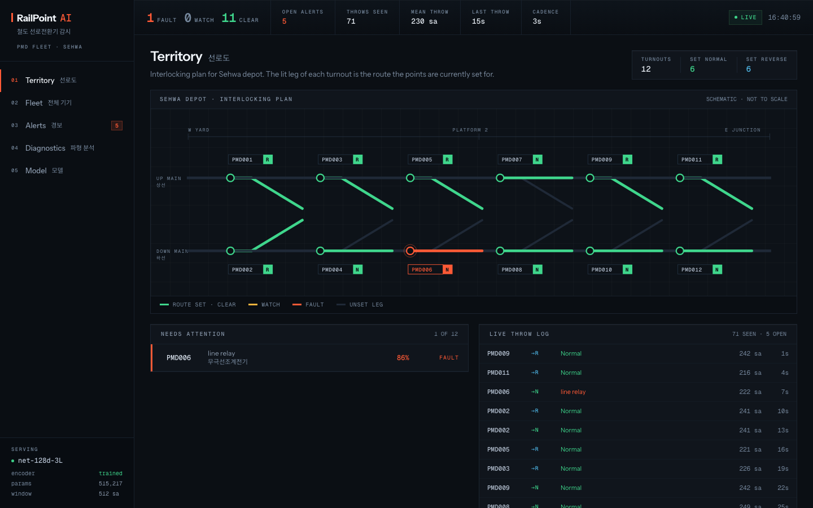
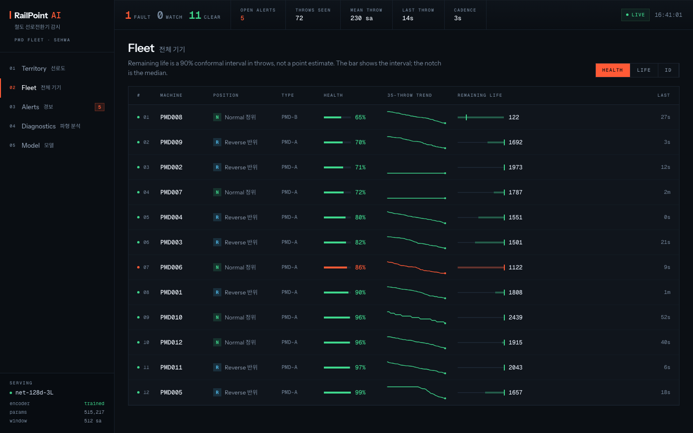
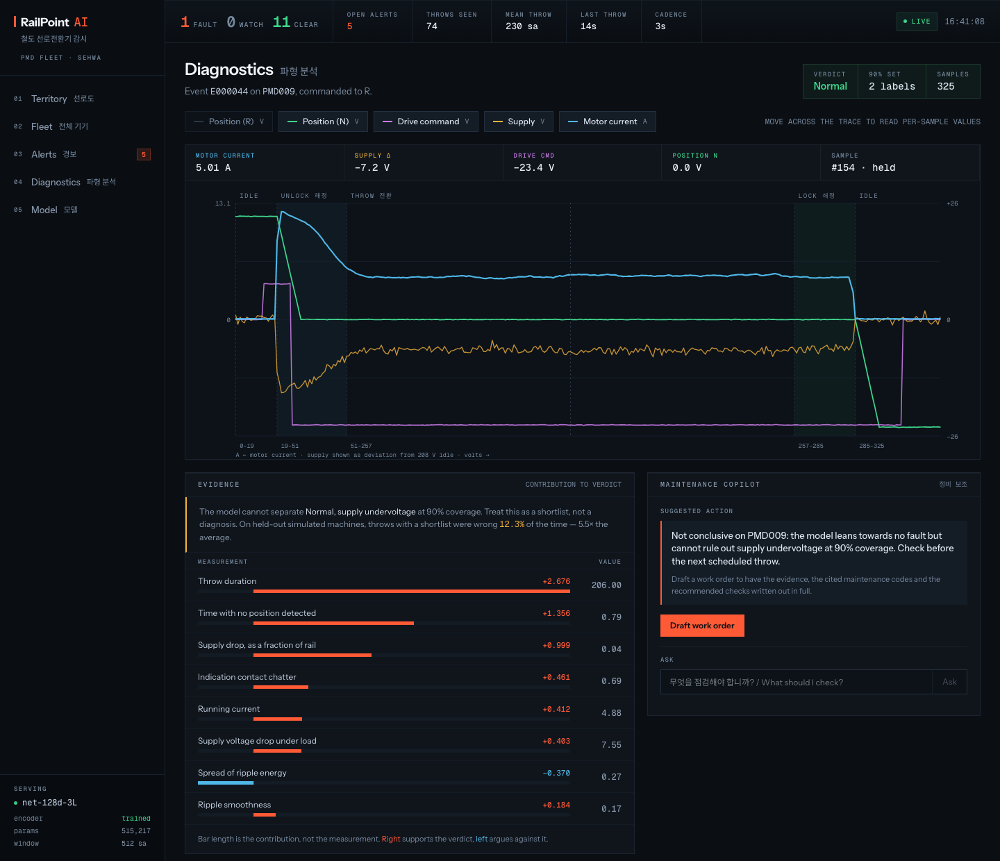
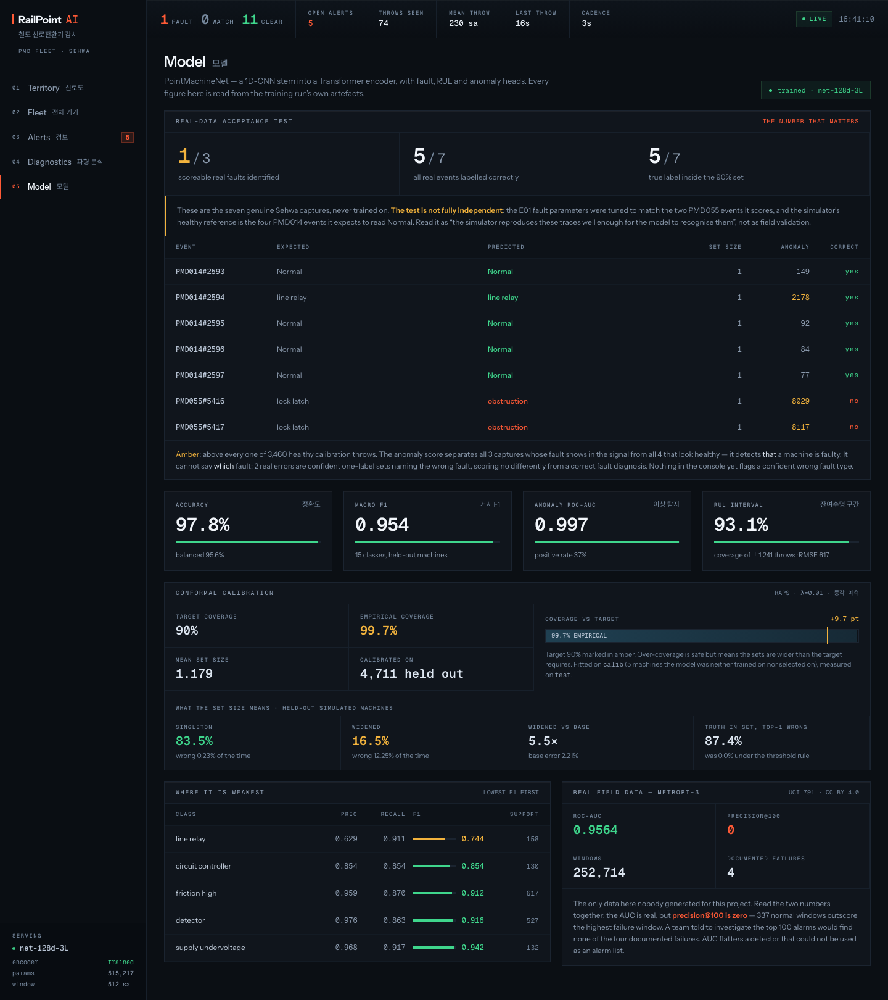
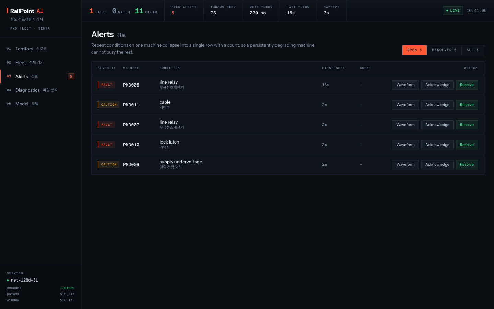
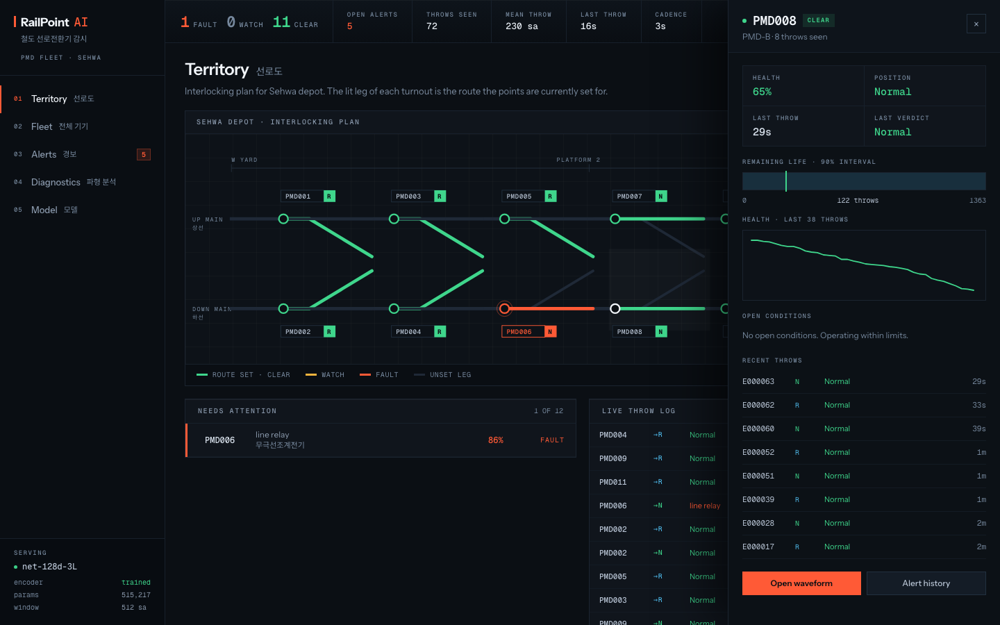

# RailPoint&#8202;·&#8202;AI

**AI-Based Failure Detection and Prediction for Railway Point Switch Machines**
철도 선로전환기 고장 탐지 및 예측

Detects and classifies faults in railway point machines from motor-current and
indication-line signals, forecasts remaining useful life, explains every
prediction, and serves it through a live operations console.

https://github.com/user-attachments/assets/433cacb7-e354-44f7-96fd-4726a1a7746e

<sub>The 27-second intro. It has sound: unmute it in the player. Sound effects: Kenney (CC0).</sub>


| | |
|---|---|
|  |  |
| **Territory** — the interlocking plan; the lit leg of each turnout is the route its points are set for | **Fleet** — every machine ranked by health, remaining life as a 90% interval |
|  |  |
| **Diagnostics** — one throw, the evidence behind the verdict, and a work-order copilot | **Model** — every figure read from the training run, leading with the one that does not flatter |
|  |  |
| **Alerts** — repeat conditions collapse to one row with a count, so one bad machine cannot bury the rest | **Inspector** — a machine's health, remaining-life interval and open conditions, without leaving the page |

> **Provenance.** This is the 2026 rebuild of *Failure Prediction of Railway Point
> Machine* — team **Fault Force**, Woosong University (우송대학교), AI & Big Data,
> Endicott College of International Studies, Sept–Dec 2024, an industry-linked
> capstone (기업연계) with **Sehwa** (Daejeon), advised by Prof. 김영일.
> Department write-up:
> [tech.endicott.ac.kr](https://tech.endicott.ac.kr/board/read.jsp?id=249398&code=tech0604).
> Original team: 유태경, 조재윤, Gazikhodjaev Nodirkhuja, Jamwal Harishik Dev Singh,
> Chaulagai Nishant. Full credit and a candid 2024→2026 comparison in
> [`docs/ORIGIN.md`](docs/ORIGIN.md).

---

## The honest version of the data problem

**There is no publicly downloadable Korean point-machine dataset.** AI Hub,
data.go.kr, KRIC Rail Portal, Kaggle, Hugging Face and Zenodo were all searched;
the Cu-3300 dataset cited in the literature as the field's first open dataset has
been deleted from GitHub. The full search record is in [`docs/DATA.md`](docs/DATA.md).

**The real Sehwa extract cannot train a model.** It is 7 switching events from 2
machines, and **every one carries a fault code** — there are no normal events.

So the data is generated, and the generator is *validated against reality rather
than asserted to match it*:

| Channel | Wasserstein (norm.) | Tolerance | | Statistic | Real | Sim | Error |
|---|---|---|---|---|---|---|---|
| `ac_curr` | 0.0055 | 0.08 | | plateau | 3.855 A | 3.892 A | 1.0% |
| `ac_volt` | 0.0268 | 0.12 | | peak | 9.797 A | 9.536 A | 2.7% |
| `as_volt` | 0.0236 | 0.10 | | throw duration | 205.5 | 208.9 | 1.7% |
| `output_n_volt` | 0.0104 | 0.10 | | capture length | 261.8 | 267.5 | 2.2% |

This gate runs wherever the real traces are available, and fails the build if
the simulator drifts from them. The traces are private (see
[Data availability](#data-availability)), so on the public CI runner it
reports itself as skipped rather than passed.

**The 7 real events are never trained on.** They are the acceptance test.

## What the physics turned out to be

Rendering the real traces for the first time — the 2024 dashboard loaded that file
and never displayed a value from it — showed the classic point-machine current
curve, and the signals independently *corroborate* the Korean maintenance codes:

- **`output_n_volt` is a three-state signal**, not a position ramp: **+23 V** locked
  Normal (정위), **~0 V in transit**, **−23 V** locked Reverse (반위). 78.8% of a
  healthy capture sits at 0 V.
- **PMD055 (E01, 기억쇠 locking latch)** reads ~0 V for all 600 samples — permanently
  in transit, never locking, drive never cut. That *is* the latch diagnosis,
  visible directly in the channel.
- **PMD014#2594** holds −23.9 V throughout with no supply sag: the motor never
  started, so the machine never unlocked.

The simulator reproduces all three.

## Results

Trained on the calibrated simulator, evaluated on machine-held-out splits **and**
on the 7 real events. Every number states which.

### The finding that matters

**Synthetic accuracy and real-world transfer are anti-correlated.**

| Model | Synthetic accuracy | Real diagnostic events |
|---|---|---|
| RandomForest | **0.9683** | 1/3 |
| HistGradientBoosting | 0.9623 | 1/3 |
| MLP | 0.9298 | **3/3** |

The MLP has the *lowest* synthetic accuracy and is the only baseline that passes.
Ranking on the synthetic test split alone would have shipped a model that gets
every real fault wrong. Full analysis:
[`experiments/results/baseline-findings.md`](experiments/results/baseline-findings.md).

### The deep model

PointMachineNet — a 1D-CNN stem into a Transformer encoder with fault, RUL and
anomaly heads, 515,217 parameters, trained on CPU. On held-out **simulated**
machines:

| | |
|---|---|
| Accuracy / balanced accuracy | **97.8%** / 95.6% |
| Macro-F1, 15 classes | **0.954** |
| Anomaly ROC-AUC | **0.997** |
| Prediction sets (RAPS, 90% target) | 99.7% coverage; a one-label set is wrong 0.23% of the time, a shortlist 12.3% |
| RUL, 90% interval | 93.1% coverage, ±1,241 throws — calibrated on 4 machines |

And on the **7 real Sehwa captures**, never trained on: **1 of 3** scoreable
faults identified, 5 of 7 events labelled correctly. Both PMD055 lock-latch
faults come out as confident, wrong, one-label sets — and nothing in the system
flags that ([RP-28](docs/BUGS.md)). The gap between those two paragraphs is the
honest state of the project. Every number is read from
[`experiments/results/deep-summary.json`](experiments/results/deep-summary.json).

## Architecture

```
capture ─► phase segmentation ─► 113 features ──────────────► baselines
        └► scale-normalised sequence + explicit scale scalar ─► CNN + Transformer
                                                                ├─ fault (15 classes)
                                                                ├─ RUL (cycles)
                                                                └─ embedding ─► Mahalanobis anomaly
                                                                        └─► conformal sets (90% coverage)
```

- **Input representation** carries shape *and* scale separately, because absolute
  amplitude does not transfer between machine classes but does carry signal.
- **Conformal prediction sets you can act on — in distribution.** RAPS,
  calibrated on a dedicated `calib` split that early stopping never sees. On
  held-out *simulated* machines 83.5% of throws get a single label, wrong 0.23% of
  the time; the 16.5% that get a shortlist are wrong 12.3% of the time — 5.5× the
  base rate. The plain threshold this replaced met its coverage target with every
  set exactly the argmax, so it never once flagged its own mistakes (RP-27).
  **It does not hold on shifted real data:** both real PMD055 errors are confident
  one-label sets, and nothing in the system yet flags a confident wrong fault
  type (RP-28). See `experiments/results/conformal-rules.md`.
- **Anomaly detection is post-hoc**, so it cannot trade classification accuracy
  for its own score, and catches faults outside the taxonomy.

## Quick start

The whole console — trained model, live feed, dashboard — in one container:

```bash
docker compose up --build
```

Then open **http://localhost:8000**. The first start takes about 30 seconds
while torch and the model weights load. The trained network ships in
`experiments/artifacts/`, so this serves the real model, not a fallback.

### Maintenance copilot

The Diagnostics page drafts a work order for the selected throw, citing the
Sehwa maintenance codes and the model's own uncertainty. It runs on a local
model through [Ollama](https://ollama.com), so nothing leaves the machine and
nothing is billed:

```bash
ollama pull qwen3.5:4b
```

Any model you have pulled appears in the panel's model menu. Without Ollama
the panel still works: drafts come from a deterministic writer, and the badge
and a note under the draft say which wrote it and why. To use Claude instead,
set `RAILPOINT_COPILOT_PROVIDER=claude` and `ANTHROPIC_API_KEY`; the model is
then fixed by `RAILPOINT_CLAUDE_MODEL`, never chosen from the dashboard,
because it is billed.

### Developing

```bash
uv venv --python 3.12 .venv && uv pip install --python .venv/bin/python -e ".[dev,ml,api]"
```

```bash
.venv/bin/railpoint build-data     # generate 60,800 labelled events
```

```bash
.venv/bin/railpoint train          # train, calibrate, evaluate, export (~1.5 h on CPU)
```

```bash
.venv/bin/railpoint recalibrate    # re-derive calibration from the existing weights (minutes)
```

API on :8000 and a hot-reloading UI on :5173:

```bash
.venv/bin/uvicorn backend.app.main:app --port 8000
```

```bash
npm --prefix frontend install && npm --prefix frontend run dev
```

## Data availability

The seven real captures come from **Sehwa** (Daejeon), the capstone's industry
partner, and are **not published**: the extract is gitignored, only its
checksums are committed (`data/raw/sehwa/SHA256SUMS`), and it has been removed
from this repository's history. Everything else is here.

What that means in practice:

| Needs the private extract | Runs from a clone |
|---|---|
| `railpoint calibrate` — the simulator calibration gate | `docker compose up` — the full console |
| the real-data acceptance test | `railpoint build-data`, `train`, `recalibrate` |
| refitting the waveform template (`scripts/fit_template.py`) | the whole test suite (gated tests skip, and say so) |

The model *was* calibrated and acceptance-tested against the real captures; the
results of that are committed in `experiments/results/`. A clone can reproduce
every number except those two, which is the line between publishing a model and
publishing someone else's data.

## Layout

| Path | |
|---|---|
| `ml/pmdlib/sim/` | Physics-informed simulator + CI calibration gate |
| `ml/pmdlib/features/` | Phase-aware feature extraction |
| `ml/pmdlib/models/` | CNN + Transformer, input preparation |
| `ml/pmdlib/eval/` | Conformal prediction, anomaly scoring, acceptance test |
| `backend/` | FastAPI, REST + WebSocket, live simulation |
| `frontend/` | React operations console |
| `legacy/dash-2024/` | The 2024 code, preserved and repaired |
| `docs/BUGS.md` | **34 defects** in the 2024 code, with fixes |
| `docs/DATA.md` | What the data is, and why no public dataset exists |
| `docs/ORIGIN.md` | Attribution and the 2024→2026 comparison |
| `design-system/MASTER.md` | Frontend design system |

## Notes

Environment: PyTorch dropped macOS x86_64 wheels after 2.2.x, so on Intel Macs
torch is pinned `<2.3`, which forces `numpy<2` and `scipy<1.14`. All pins are
platform-conditional; other machines get current versions.

Headline metrics are on **simulated data calibrated to 7 real traces**. The
real-trace acceptance test is reported separately and is the number that matters.

## License

MIT for the code. The Sehwa extract is company-provided industrial data — see
[`docs/DATA.md`](docs/DATA.md) and the open item in [`docs/ORIGIN.md`](docs/ORIGIN.md).
